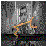
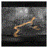
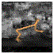
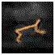
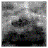

# Learning Task Informed Abstractions (TIA)

<sub>Left to right: Raw Observation, Dreamer, Joint of TIA, Task Stream of TIA, Distractor Stream of TIA</sub>

     


This code base contains a minimal modification over [Dreamer](https://danijar.com/project/dreamer/)/[DreamerV2](https://danijar.com/project/dreamerv2/) to learn disentangled world models, presented in:

**Learning Task Informed Abstractions**

Xiang Fu*, Ge Yang*, Pulkit Agrawal, Tommi Jaakkola

ICML 2021 [[website]](https://xiangfu.co/tia) [[paper]](https://arxiv.org/abs/2106.15612)


The directory [Dreamer](./Dreamer) contains code for running DMC experiments. The directory [DreamerV2](./DreamerV2) contains code for running Atari experiments. This implementation is tested with Python 3.6, Tensorflow 2.3.1 and CUDA 10.1. The training/evaluation metrics used for producing the figures in the paper can be downloaded from [this Google Drive link](https://drive.google.com/file/d/1wvSp9Q7r2Ah5xRE_x3nJy-uwLkjF2RgX/view?usp=sharing).

## Getting started

Get dependencies:

```sh
pip3 install --user tensorflow-gpu==2.3.1
pip3 install --user tensorflow_probability==0.11.0
pip3 install --user gym
pip3 install --user pandas
pip3 install --user matplotlib
pip3 install --user ruamel.yaml
pip3 install --user scikit-image
pip3 install --user git+git://github.com/deepmind/dm_control.git
pip3 install --user 'gym[atari]'
```
You will need an active Mujoco license for running DMC experiments. 

## Running DMC experiments with distracting background

Code for running DMC experiments is under the directory [Dreamer](./Dreamer).

To run DMC experiments with distracting video backgrounds, you can download a small set of 16 videos (videos with names starting with ''A'' in the Kinetics 400 dataset's `driving_car` class) from [this Google Drive link](https://drive.google.com/file/d/1f-ER2XnhpvQeGjlJaoGRiLR0oEjn6Le_/view?usp=sharing), which is used for producing Figure 9(a) in the paper's appendix.

To replicate the setup of [DBC](https://github.com/facebookresearch/deep_bisim4control) and use more background videos, first download the Kinetics 400 dataset and grab the `driving_car` label from the train dataset. Use the repo:

[https://github.com/Showmax/kinetics-downloader](https://github.com/Showmax/kinetics-downloader) 

to download the dataset.

Train the agent:

```sh
python run.py --method dreamer --configs dmc --task dmc_cheetah_run_driving --logdir ~/logdir --video_dir VIDPATH
```

`VIDPATH` should contains `*.mp4` video files. (if you used the above repo to download the Kinetics videos, you should set `VIDPATH` to `PATH_TO_REPO/kinetics-downloader/dataset/train/driving_car`)


Choose method from:

```
[dreamer, tia, inverse]
```

corresponding to the original Dreamer, TIA, and representation learned with an inverse model as described in Section 4.2 of the paper.


Choose environment + distraction (e.g. `dmc_cheetah_run_driving`):

```
dmc_{domain}_{task}_{distraction}
```

where {domain} (e.g., cheetah, walker, hopper, etc.) and {task} (e.g., run, walk, stand, etc.) are from the DeepMind Control Suite, and distraction can be chosen from:

```
[none, noise, driving]
```

where each option uses different backgrounds:
```
none: default (no) background

noise: white noise background

driving: natural videos from the ''driving car'' class as background
```

## Running Atari experiments

Code for running Atari experiments is under the directory [DreamerV2](./DreamerV2).

Train the agent with the game Demon Attack:

```sh
python dreamer.py --logdir ~/logdir/atari_demon_attack/TIA/1 \
    --configs defaults atari --task atari_demon_attack
```

## Monitoring results

Both DMC and Atari experiments log with tensorboard by default. The decomposition of the two streams of TIA is visualized in `.gif` animation. Access tensorboard with the command:

```sh
tensorboard --logdir LOGDIR
```

## Citation


If you find this code useful, please consider citing our paper:

```
@InProceedings{fu2021learning,
title = {Learning Task Informed Abstractions},
author = {Fu, Xiang and Yang, Ge and Agrawal, Pulkit and Jaakkola, Tommi},
booktitle = {Proceedings of the 38th International Conference on Machine Learning},
pages = {3480--3491},
year = {2021},
editor = {Meila, Marina and Zhang, Tong},
volume = {139},
series = {Proceedings of Machine Learning Research},
month = {18--24 Jul},
publisher = {PMLR},
pdf = {http://proceedings.mlr.press/v139/fu21b/fu21b.pdf},
url = {http://proceedings.mlr.press/v139/fu21b.html}
}
```

## Reference

We modify [Dreamer](https://github.com/danijar/dreamer) for DMC environments and [DreamerV2](https://github.com/danijar/dreamerv2) for Atari games. Thanks Danijar for releasing his very clean implementation! Utilities such as 

- Logging with Tensorboard/JSON line files 
- debugging with the `debug` flag
- mixed precision training

are the same as in the respective original implementations.
